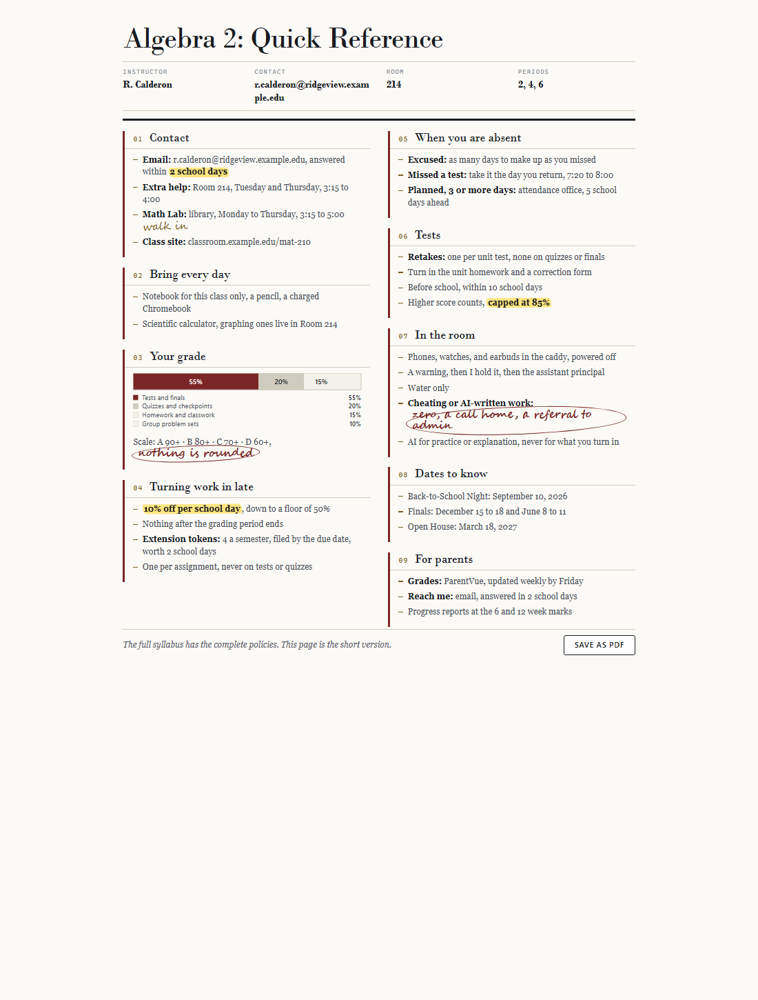

# syllabus-quickref

Turn a course syllabus into one page a student reads in ninety seconds and a
parent searches in ten.

The full syllabus stays exactly as it is. This is a companion page, which is
what makes the cutting safe: nothing is lost, and the compliance language is no
longer standing between a family and the answer they came for.



## What it does

- **Cuts.** District boilerplate, policy citations, standards codes, and
  anything that only matters in a dispute come out. What a family acts on stays.
- **Checks.** `check.py` traces every number, email and link in the rewrite back
  to a line in the syllabus, so an invented late penalty fails the build instead
  of reaching thirty printed copies. Quiet invention is the real failure mode
  here, and it is the one nobody catches by proofreading.
- **Renders.** A print-ready two-column letter page as HTML and PDF, an editable
  `.docx`, and a folded trifold pamphlet, in five themes.

## Install

Clone it anywhere. The scripts are Python 3 and use only the standard library.

```bash
git clone https://github.com/shuff57/syllabus-quickref
cd syllabus-quickref
```

Optional extras, only for the formats that need them: `python-docx` for `.docx`
output, and `PyMuPDF` or `pypdf` for pulling text out of a PDF syllabus. PDF
output needs Chrome or Edge installed, which the renderer finds itself.

To use it as a [Claude Code](https://claude.com/claude-code) skill, clone it
into your skills directory instead, and Claude will pick it up by name:

```bash
git clone https://github.com/shuff57/syllabus-quickref ~/.claude/skills/syllabus-quickref
```

`SKILL.md` is the full working procedure, and it reads perfectly well as a
human's how-to if you would rather do this by hand.

## Use it

```bash
# 1. get the syllabus into plain text
python scripts/extract.py syllabus.pdf                 # -> syllabus.source.txt

# 2. write algebra2-quickref.md, following the skeleton in SKILL.md

# 3. prove every fact on the page came from the syllabus
python scripts/check.py algebra2-quickref.md --source syllabus.source.txt

# 4. render
python scripts/render.py algebra2-quickref.md --theme annotated \
       --html algebra2.html --pdf algebra2.pdf --docx algebra2.docx

# and for back-to-school night
python scripts/pamphlet.py algebra2-quickref.md
```

## The example

`example/` carries a made-up syllabus for a made-up school, the quick reference
cut from it, and that page rendered in all five themes. Nothing in it belongs to
a real teacher, which is the point: it is there to be copied.

| File | What it is |
|---|---|
| `example/sample-syllabus.source.txt` | The input. Thirteen sections of district prose, roughly 1,400 words. |
| `example/sample-quickref.md` | The output. One page, 9 sections, under 360 words. |
| `example/out/` | That page in each theme, as HTML, PDF, and a screenshot. |

## Themes

`--theme NAME`, or `--list-themes` to see what is installed.

| Theme | What it is | Preview |
|---|---|---|
| `bookshelf` | The default. Parchment, one blue accent, rules instead of frames. | [png](example/out/shot-bookshelf.png) |
| `annotated` | The ledger. Open ruled masthead, each section ruled down its left edge, Bodoni over Charter. | [png](example/out/shot-annotated.png) |
| `spec` | The technical one. Monospace, coded section IDs, boxed compartments under filled header bars. | [png](example/out/shot-spec.png) |
| `markedup` | Hand-drawn frames in academic serif, keeping `spec`'s ID chips. | [png](example/out/shot-markedup.png) |
| `whiteboard` | Pens and markers on white. Drawn frames, cursive headings, checkbox bullets. | [png](example/out/shot-whiteboard.png) |

Three marks a teacher actually makes on a page survive into every output:
`==highlighted==`, `((circled))`, and `~~an aside in hand~~`.

Writing another theme: drop a `NAME.css` in `scripts/themes/` redefining the
token block at the top of `spec.css`. Change the structure too, not only the
colours and the fonts. `annotated` started life as `spec` with the typefaces
swapped and printed as the same page twice.

## License

MIT.
